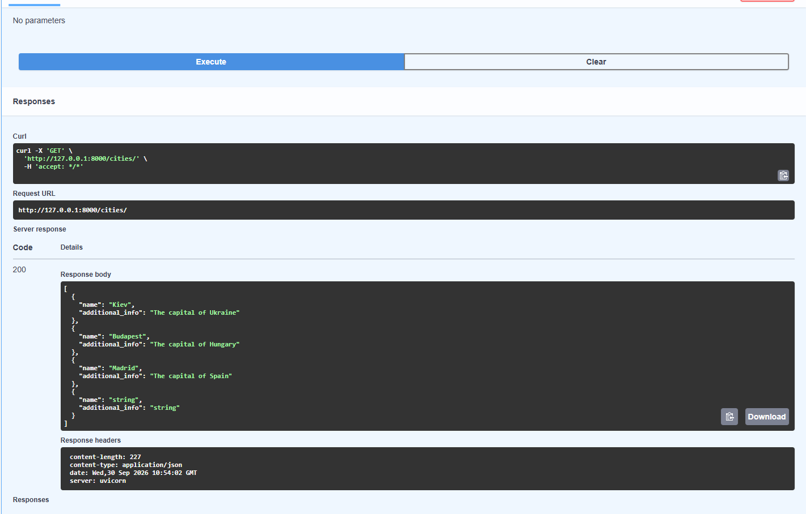
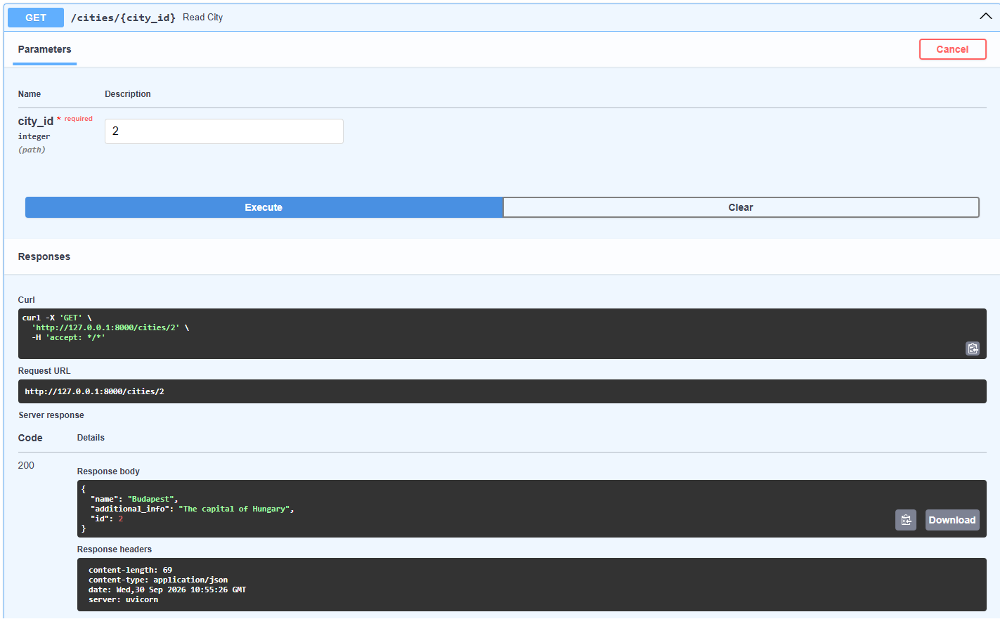
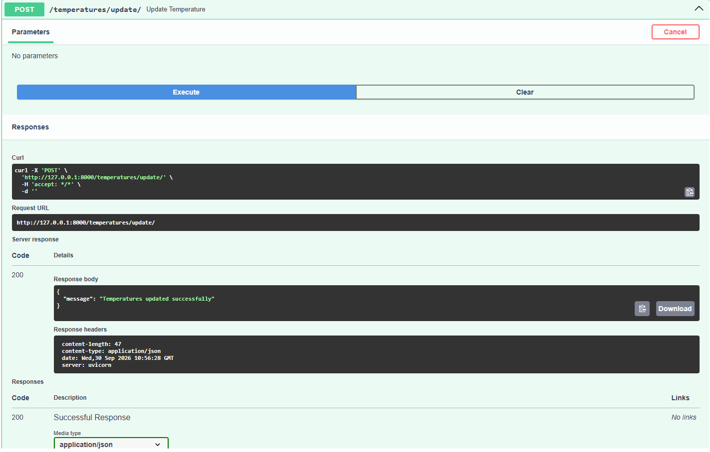

# City Temperature Management API

The API allows users to create, retrieve, update and delete cities and temperature records, as well as retrieve 
temperature records for a specific city.

## Installation using GitHub

Uvicorn, FastAPI, SQLAlchemy and Alembic must be already installed

```bash
git clone https://github.com/KiporenkoMaksym/py-fastapi-city-temperature-management-api
python -m venv venv
venv/Scripts/activate
pip install -r requirements.txt
alembic revision --autogenerate -m "Initial migration"
alembic upgrade head
uvicorn main:app --reload
Now open a browser and go to: http://127.0.0.1:8000
```

## Features

- Create, read, update and delete cities
- Create, read, temperature records
- We get temperature records for all cities from the database, using the online resource we have selected.
- Get temperature records for a specific city

## Demo



